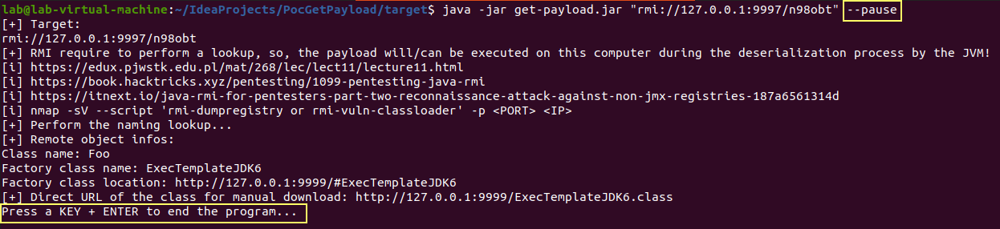
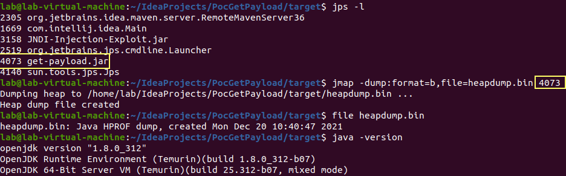
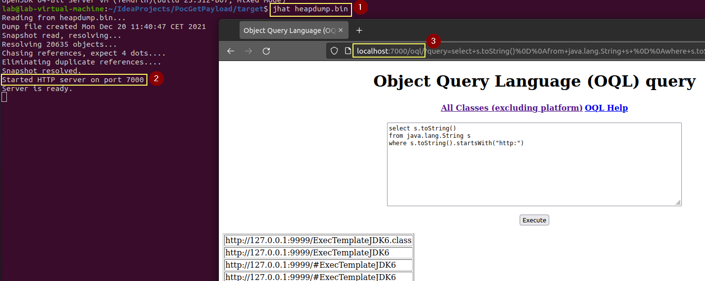
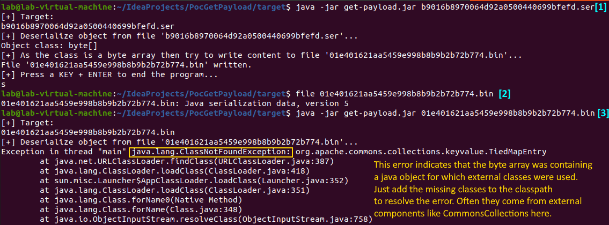

# Objective

[](https://github.com/righettod/log4shell-payload-grabber/actions/workflows/maven.yml)

Tool to try to retrieve the java class used as dropper for the RCE.

The tool was tested again the following attacks kit:

* [JNDI-Exploit-Kit](https://github.com/pimps/JNDI-Exploit-Kit).
* [JNDIExploit](https://github.com/fengzhouc/JNDIExploit).
* [Rogue-JNDI](https://github.com/veracode-research/rogue-jndi).

It is a [IntelliJ IDEA](https://www.jetbrains.com/idea/download) project.

# Requirements

[Java 8](https://adoptium.net/releases.html?variant=openjdk8) is required for compilation and execution because classes only present in this JDK are used for RMI information retieval.

Need Maven3+ for the building.

# Usage

```bash
$ java -jar get-payload.jar
[+] Missing LDAP/LDAPS/RMI URL or SER file!
     URL: rmi://127.0.0.1:9997/gchero [--pause]
          ldap://127.0.0.1:9998/gcherG
SER file: 899f0d32098d4f3b8d54ffa21fe9b0b6.ser
1) For RMI, if a second parameter, named '--pause', is specified then
the program wait the user press a key before to end the program allowing taking a heap dump
of the JVM process to capture the loaded remote object.
2) If a SER (serialized java object) file is passed then the program will load it
and wait the user press a key before to end the program allowing taking a heap dump like for RMI.
```


Full demonstration in [this video](demo-full.mp4).

Use the following command to directly extract the download URL of the class when it is available:

```bash
$ java -jar get-payload.jar "ldap://127.0.0.1:1389/Basic/TomcatMemshell" | grep "Direct URL" | cut -d" " -f10
http://127.0.0.1:8080/com.feihong.ldap.template.TomcatMemshellTemplate.class
```

For RMI, a second optional parameter named **--pause**, can be used to add a "virtual" break point allowing to perform a memory dump of the JVM tool process in order to capture loaded remote object:





Once created, the memory dump can be analyzed with different tools like for example [jhat](https://docs.oracle.com/javase/7/docs/technotes/tools/share/jhat.html):





# Compilation

Use the script named [package.sh](package.sh) and the binary jar file will be present in the **target** folder.

# Exploit class decompilation

The following tools can be used to achieve this task:
- GUI: http://java-decompiler.github.io/
- CMD: https://github.com/intoolswetrust/jd-cli
