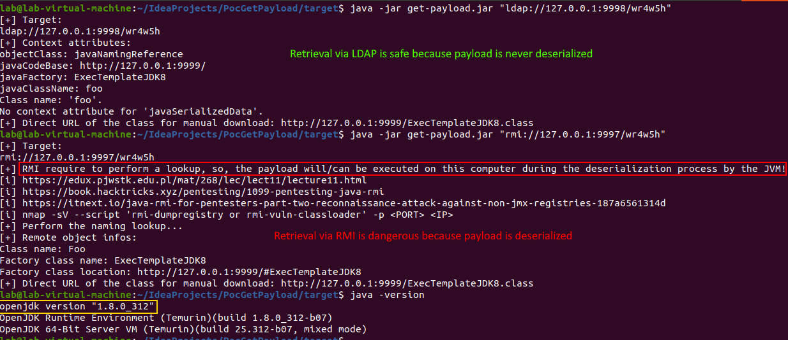

# Objective

Tool to try to retrieve the java class used as dropper for the RCE.

The tool was developed and tested again the tool named [JNDI-Exploit-Kit](https://github.com/pimps/JNDI-Exploit-Kit).

It is a [IntelliJ IDEA](https://www.jetbrains.com/idea/download) project.

# Requirements

[Java 8](https://adoptium.net/?variant=openjdk8&jvmVariant=hotspot) is required for compilation and execution because classes only present in this JDK are used for RMI information retieval.

Need Maven3+ for the building.

# Usage

Full demonstration in [this video](demo-full.mp4).

# Compilation

Use the script named [package.sh](package.sh) and the binary jar file will be present in the **target** folder.
